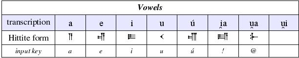

# Hittite Font

This font includes 
* Vowels
* Consonant + Vowel sequences
* Vowel + consonant sequences
* Ideograms
* Numbers

## Quick Start Instructions

1. This font will work in any program that can use .ttf files (such as StarOffice, OpenOffice, Microsoft Office). For most users all you'll need to do is save Hittite.ttf in your Fonts directory. Here are the locations of the font directories for some popular operating systems: *

### Windows

* Windows 2000,NT - C:\WINNT\Fonts
* Windows XP,98,95 - C:\WINDOWS\Fonts

### Mac OS

* Mac OS X - /Applications/Microsoft\ Office\ X/Office/Fonts/

### Unix/Linux

* Try first to update your font server or font database. Information you may need: your distribution (e.g. debian, mandrake, redhat) your desktop (e.g. gnome, kde)
* Tested in RedHat 9 : type /usr/lib/openoffice/program/spadmin at the command line, a GUI (graphical user interface) will pop up. Click on "Fonts..." then click on "Add..." then on "..." to browse the location of the folder the font is in.
* Default Font Directory - /usr/X11R6/lib/X11/fonts/TTF/
(It's recommended that you do a search on google for how to add a font on your system.)

2. If you have your word processor open (such as StarOffice, OpenOffice or Microsoft Word) you will normally need to close the word processor and reopen it again in order to use your new font. The font will be located alphabetically in your font list where "Hittite" would appear but it will be written in Hittite characters!

This should be all the "installation" that you will need to do. If these instructions don't work post a description of your problem (as well as information about your operating system and which word processor you are using) in the forums of the Hittite project at http://sourceforge.net.

## Using the font (i.e. finding the symbols)

Download the user guide (if link doesn't work go to http://sourceforge.net and search for hittite) If you have questions or problems see the forums of the Hittite project at http://sourceforge.net.

## Extra Info

This font has been created using the free program pfaedit on a RedHat Linux machine using Gnome desktop and OpenOffice as a word processor. Pfaedit can be found at: http://pfaedit.sourceforge.net   I made this font in order to type our final project for our Hittite class.

This font is an open source project. There are many reasons to choose an open source font. The most compelling is that the font can be quickly updated and customized to suit your uses.

The source file for the Hittite font can be found at https://sourceforge.net/project/showfiles.php?group_id=85046. Any modified editions of the Hittite font should indicate its original creator and documentation (http://hittite.soundforge.net).

For use and distribution information see the GNU General Public License provided at the end of the user guide.

## Files

Click on the filename to download the files

 .ttf file  |   users guide |   source file
 --- |:---:| ---
[Hittite.ttf](Hittite.ttf) |   [hittitefontguide.english0.0.2.pdf](hittitefontguide.english0.0.2.pdf)  |  [hittite030420.sfd](hittite030420.sfd) 

Sample of the font

* [Die Hethitische Prüfung](samples/hittiteexam030420.pdf)

## Changelog

* Docs July 5th 2003

----

* Note: One way of locating the font directory is by doing a search on your hard drive or "My Computer" for ".ttf" (without the quote marks). This should return a list of all True Type Font files on your computer, with this list you should be able to find the font directory.
